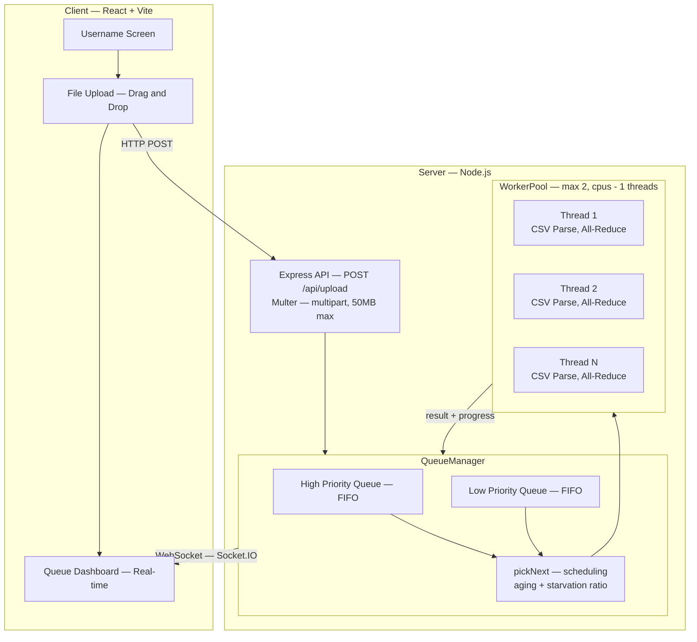

# Binaire Freznel — Multi-User Queueing System

A distributed task queueing system that accepts CSV files from multiple clients, processes them in parallel using Worker Threads, and streams real-time progress to all connected users via WebSockets.

## Tech Stack

| Layer | Technology |
|:---|:---|
| Frontend | React 19, Vite, TailwindCSS v4 |
| Backend | Node.js, Express, Socket.IO |
| Processing | `worker_threads`, `csv-parse` (streaming) |
| Language | TypeScript (full-stack) |
| Monorepo | npm workspaces |

## Architecture



## Project Structure

```
Binaire-Assignment/
├── package.json                 # Root workspace config
├── shared/
│   └── src/types.ts             # Priority, TaskStatus, SocketEvents, ITask
├── server/
│   └── src/
│       ├── index.ts             # Express + Socket.IO entry point
│       ├── config.ts            # Server configuration
│       ├── models/
│       │   ├── Task.ts          # Task class (UUID, status transitions, rank)
│       │   └── ClientSession.ts # Client tracking with reconnect support
│       ├── queue/
│       │   ├── PriorityQueue.ts # FIFO queue with memory compaction
│       │   └── QueueManager.ts  # Scheduler (aging, starvation prevention)
│       ├── workers/
│       │   ├── WorkerPool.ts    # Fixed-size thread pool with timeouts
│       │   └── csvProcessor.worker.ts  # Streaming CSV all-reduce
│       ├── routes/
│       │   └── upload.ts        # POST /api/upload (multer)
│       └── sockets/
│           └── handler.ts       # Socket.IO event handlers
└── client/
    └── src/
        ├── main.tsx
        ├── App.tsx              # Identity screen + dashboard
        ├── index.css            # TailwindCSS v4 theme
        ├── hooks/
        │   └── useSocket.ts     # Socket.IO connection + state
        └── components/
            ├── Layout.tsx
            ├── QueueMetrics.tsx  # Live stat cards
            ├── FileUpload.tsx   # Drag-and-drop + priority toggle
            └── TaskCard.tsx     # Task progress + result display
```

## Setup

```bash
git clone <repo-url>
cd Binaire-Assignment
npm install
```

Build the shared types:

```bash
npx tsc --project shared/tsconfig.json
```

Start the backend:

```bash
npm run dev --workspace=server
```

Start the frontend (separate terminal):

```bash
npm run dev --workspace=client
```

Open `http://localhost:5173` in your browser.

## How It Works

1. A user enters their name and connects via WebSocket.
2. They upload a CSV file and select a priority level (High or Standard).
3. The server creates a `Task` object and places it into the appropriate `PriorityQueue`.
4. The `QueueManager` scheduler picks the next task based on priority and dispatches it to an available worker thread.
5. The worker thread streams through the CSV file, parses every row, and sums all numeric values (all-reduce).
6. Progress updates are sent back to the main thread via `parentPort.postMessage()` and broadcast to all connected clients in real-time.
7. On completion, the result is displayed on the task card.

## OOP Class Design

| Class | Responsibility |
|:---|:---|
| `Task` | Domain model. Holds file metadata, status, progress, result. Enforces valid status transitions (no backward moves). Computes rank as `rows × cols`. |
| `ClientSession` | Tracks a connected user's socket ID and task ownership. Supports reconnection. |
| `PriorityQueue` | FIFO queue backed by an array with head pointer. Compacts memory after 500 dequeues. Supports `remove()` for aging. |
| `QueueManager` | Central orchestrator. Owns two queues (high/low), the worker pool, and all scheduling logic. Extends `EventEmitter` to broadcast state changes. |
| `WorkerPool` | Manages a fixed-size pool of `worker_threads`. Each task gets its own thread with a 5-minute timeout. Tracks active workers by task ID. |

## Scheduling Algorithm

The `QueueManager.pickNext()` method implements the following:

1. **High priority first** — always dequeues from the high-priority queue when available.
2. **Starvation ratio** — after 3 consecutive high-priority tasks, forces the next dequeue from the low-priority queue (configurable via `STARVATION_RATIO`).
3. **Aging** — a background interval checks every 5 seconds. Any low-priority task waiting longer than 30 seconds is promoted to the high-priority queue (configurable via `AGING_THRESHOLD_MS`).
4. **Parallel dispatch** — `processNext()` loops until all available workers are filled. Each task completion triggers another dispatch cycle.

## Deadlock Analysis

### Possible Deadlocks

| Type | Scenario | Mitigation |
|:---|:---|:---|
| **Priority Inversion / Starvation** | Continuous high-priority uploads prevent low-priority tasks from ever executing. | Aging mechanism promotes starved tasks after 30s. Starvation ratio forces 1 low-priority task per every 3 high-priority. |
| **Worker Pool Exhaustion** | All threads are busy. New tasks queue up indefinitely and memory grows. | Fixed pool size (`os.cpus() - 1`). Tasks wait in bounded queues. Per-client limit of 10 active tasks. |
| **File Lock / Circular Wait** | Multiple workers try to read the same file simultaneously. | Each upload gets a UUID-based filename. No shared file state between workers. |
| **Event Loop Blocking** | Large CSV processing blocks the main thread, freezing WebSocket updates for all clients. | All CPU work runs in `worker_threads`. Main thread only handles I/O. |
| **Memory Exhaustion** | N clients upload M large files simultaneously. | Multer enforces 50MB file size limit. Stream-based CSV parsing (never loads entire file into memory). Per-client task cap. |

### Impact on Productivity

- **Starvation** → low-priority users never receive results
- **Pool exhaustion** → entire system appears frozen to all users
- **Event loop blocking** → dashboard stops updating, users assume the system crashed
- **Memory exhaustion** → server process crashes, all in-flight tasks are lost

## Configuration

All values are in [config.ts](server/src/config.ts):

| Key | Default | Description |
|:---|:---|:---|
| `PORT` | 3001 | Server port |
| `CORS_ORIGIN` | `http://localhost:5173` | Allowed frontend origin |
| `MAX_FILE_SIZE` | 50 MB | Multer upload limit |
| `WORKER_POOL_SIZE` | `os.cpus() - 1` (min 2) | Number of worker threads |
| `AGING_THRESHOLD_MS` | 30,000 | Time before low-priority promotion |
| `STARVATION_RATIO` | 3 | Max consecutive high-priority before forcing a low |
| `MAX_TASKS_PER_CLIENT` | 10 | Concurrent task limit per user |
| `WORKER_TIMEOUT_MS` | 300,000 | Per-task timeout (5 minutes) |

## API

### `POST /api/upload`

Multipart form upload.

| Field | Type | Required |
|:---|:---|:---|
| `file` | File (.csv) | Yes |
| `clientId` | string | Yes |
| `clientName` | string | Yes |
| `priority` | `"HIGH"` or `"LOW"` | Yes |

Response: `{ success: true, taskId: "uuid", message: "Queued for processing" }`

### `GET /api/health`

Returns `{ status: "ok", uptime: number, stats: IQueueStats }`

### `GET /api/tasks`

Returns all tasks as `ITask[]`.

## Socket Events

| Event | Direction | Payload |
|:---|:---|:---|
| `client:register` | Client → Server | `{ clientId, clientName }` |
| `queue:status` | Server → Client | `ITask[]` |
| `queue:stats` | Server → Client | `IQueueStats` |
| `task:status-update` | Server → Client | `ITask` |
| `task:progress-update` | Server → Client | `{ taskId, progress, processId }` |
| `task:completed` | Server → Client | `{ taskId, result, completedAt }` |
| `task:failed` | Server → Client | `{ taskId, error }` |

## Testing

Open multiple browser tabs at `http://localhost:5173`. Each tab registers as a separate user. Upload CSV files from different tabs and watch them appear in the global queue with real-time progress updates.
